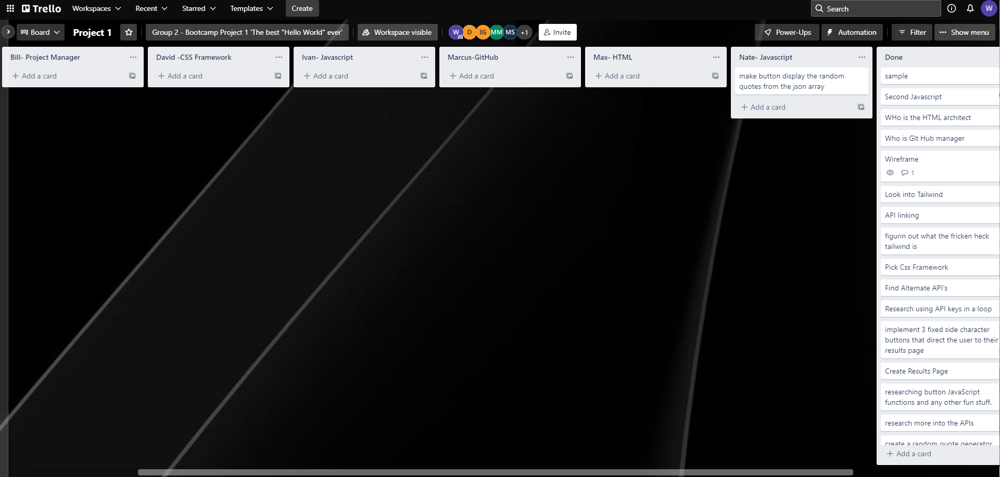

# Project-1
This is the first project.
 
 User Story

 As a... lover of Lord of the Rings
 I want...to learn more about LOTR chatacters
 So that... I can dive deeper into my fandom

 The division of labor for the project was as follows...
 
 David Deitz - CSS
 Nate Labine - JavaScript
 Ivan Goya - JavaScript
 Marcus Martinez - GitHub management
 Max Shaw - HTML
 Bill Hardgrove - Project Management

TECHNOLOGY

Trello was used for ticket managemet
https://trello.com/en-US

Milligram was used for the CSS framework.
https://milligram.io/

Font Squirrel was used for coverting webfonts to a WebFont Kit with CSS
https://www.fontsquirrel.com/tools/webfont-generator

