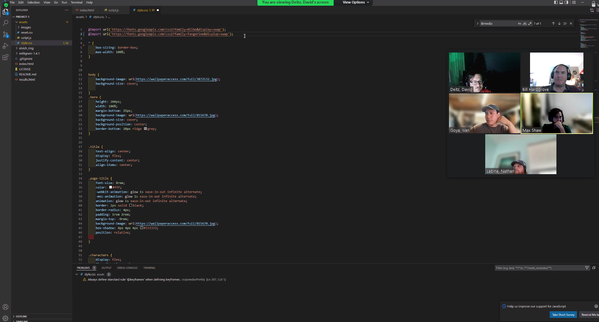

# Project-1

The One Wiki is a group project that allows the user see the wiki's of developer selected popular LOTR characters, and  allows them to research further by selecting gender and race to discover new characters and link to the character wiki
 
 USER STORY

 As a... lover of Lord of the Rings
 I want...to learn more about LOTR chatacters
 So that... I can dive deeper into my fandom

 AREAS OF RESPONSIBILITY

 David Deitz - CSS
 Nate Labine - JavaScript
 Ivan Goya - JavaScript
 Marcus Martinez - GitHub management
 Max Shaw - HTML
 Bill Hardgrove - Project Management

TECHNOLOGY USED

Trello was used for ticket managemet
https://trello.com/en-US

API for font:
https://fonts.google.com/specimen/Tangerine

API for information on Lord of the Rings:
https://the-one-api.dev/

Milligram was used for the CSS framework:
https://milligram.io/

Font Squirrel was used for coverting webfonts to a WebFont Kit with CSS:
https://www.fontsquirrel.com/tools/webfont-generator

URL to GitHub repository:
https://github.com/marcu0912/Project-1

URL to launch the applictaion:
https://marcu0912.github.io/Project-1/

WIREFRAME

FINAL PAGE LAYOUT
