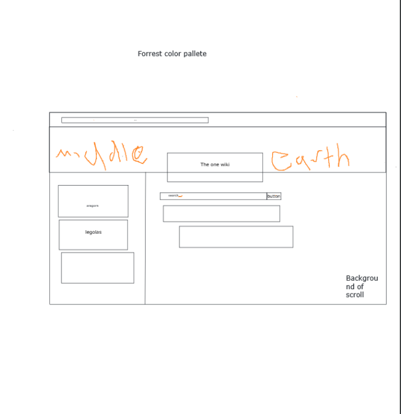
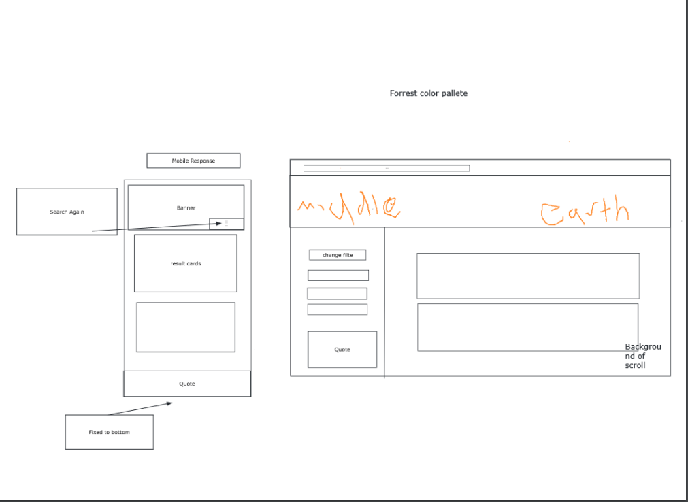
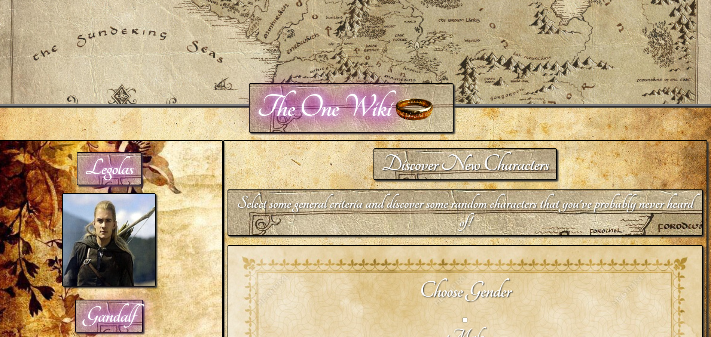
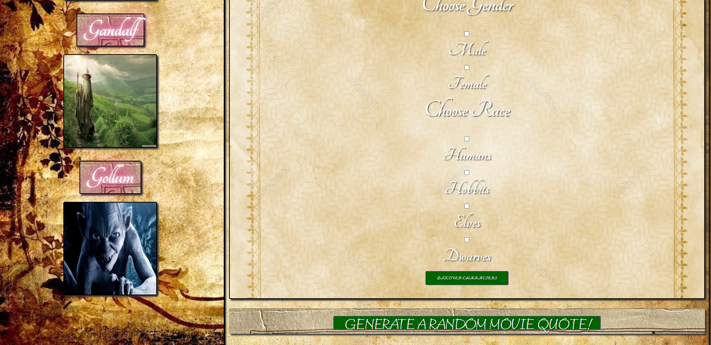
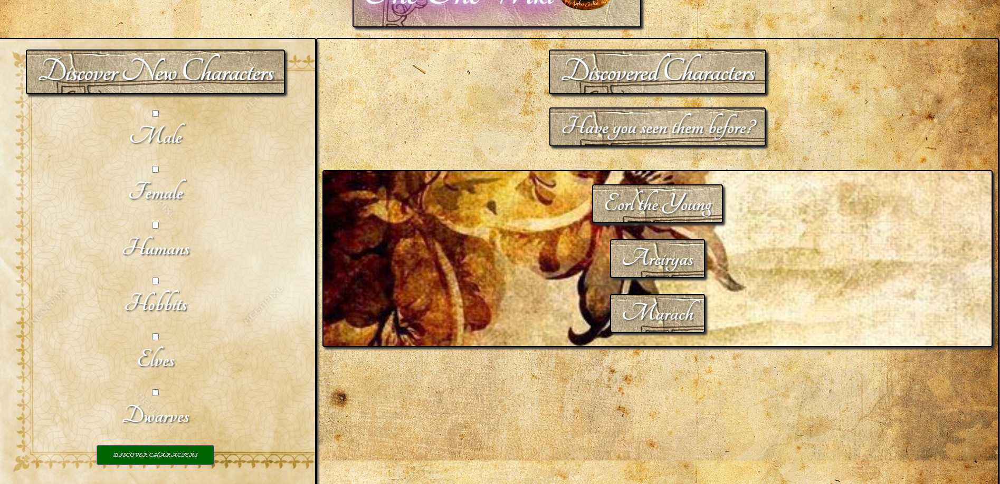

# Project-1

"The One Wiki" is a group project that allows the user see the wiki's of developer selected popular LOTR characters. It also allows them to research further by selecting gender and race to discover new characters and link to the characters wiki.
 
 **USER STORY**

 As a... lover of Lord of the Rings
 I want...to learn more about LOTR characters
 So that... I can dive deeper into my fandom

***

 **AREAS OF RESPONSIBILITY**

 David Deitz - CSS     GitHub  [IonicCraze](https://github.com/IonicCraze)

 Nate Labine - JavaScript     GitHub [njlabine](https://github.com/njlabine)

 Ivan Goya - JavaScript    GitHub   [IvanGoya](https://github.com/IvanGoya)

 Marcus Martinez - GitHub management   GitHub  [marcu0912](https://github.com/marcu0912)

 Max Shaw - HTML   GitHub  [Maxthemilian52](https://github.com/Maxthemilian52)

 Bill Hardgrove - Project Management   Github  [WmHHardgrove](https://github.com/WmHHardgrove)

***

**TECHNOLOGY USED***

Trello was used for ticket management
https://trello.com/en-US

API for font:
https://fonts.google.com/specimen/Tangerine

API for information on Lord of the Rings:
https://the-one-api.dev/

Milligram was used for the CSS framework:
https://milligram.io/

Font Squirrel was used for converting webfonts to a WebFont Kit with CSS:
https://www.fontsquirrel.com/tools/webfont-generator

URL to GitHub repository:
https://github.com/marcu0912/Project-1

URL to launch the applictaion:
https://marcu0912.github.io/Project-1/

***

**WIREFRAME**

***

**FINAL PAGE LAYOUT**

**LANDING PAGE UPPER**

**LANDING PAGE LOWER**

**RESULTS PAGE**

